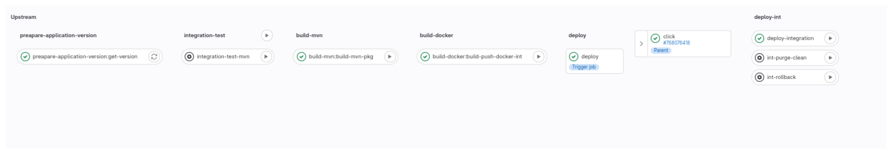

# Click Count application

## Description

Design of an MVP architecture based on Gitlab CI CD Pipelines.

## Plan

* General Overview
* Architecture
    1. Environment
    2. tools
* Pipelines
    1. Application deployment
    2. Infrastructure deployment
* Extra components

## General Overview

In this picture, you can find the global architecture deployed in
a GKE cluster following a GitLab CI/CD pipeline. 

## Architecture

### Environment

### Tools:

* Gitlab : versioning tool and CI/CD pipeline
* Terraform: Provisioning the infrastructure
* Google Cloud: deploying on cloud
* Helm chart: For the deployment

## Pipelines

### Environments

We have 3 environments which are based on Gitlab branches :

* DEV
* INT
* PROD

In each branch, we have multiple stages:
For the CI pipeline:

     * Extract application version
     * Code validation
     * Test application
     * Build
     * containerize the application
For the CD pipeline:

     * Deploy the application
     * Rollback
     * Purge/Clean

For each branch/ENV, we have specific stages to be executed.
In the INT branch , it has specific tests

Image
Only in the Dev branch,the `validate` and `lint` stages will be run.
  * Develop Branch => DEV ENV

  * Integration Branch => INT ENV

  * Master Branch => PROD ENV

### Infrastructure deployment

Using Terraform manifests and Gitlab pipelines, we can create a cluster in GKE
and needed resources for the infrastructure such as namespaces and others.

## Extra components

We can use ArgoCD Agent to automate the CD part instead of Helm.
